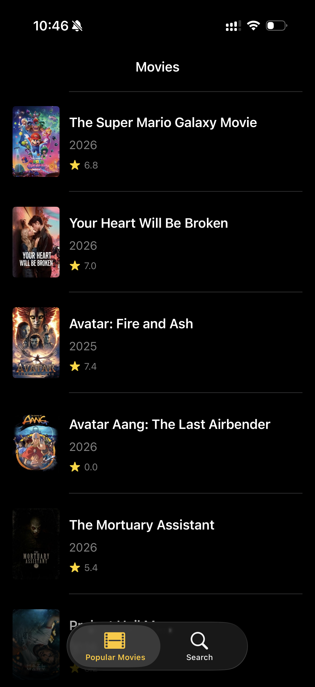
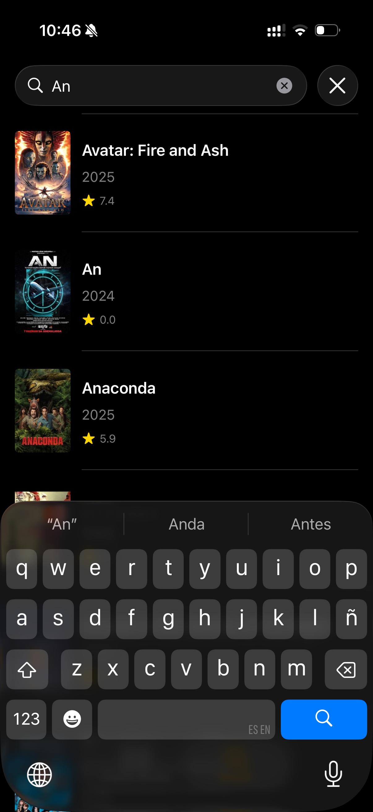

# MovieDataBase (TMDB)

A modern iOS application for browsing and searching movies, built to demonstrate clean architecture principles and scalable design patterns. This project serves as a reference implementation showcasing how to structure an iOS app using industry-standard patterns while maintaining testability and separation of concerns.

## Architecture

The app follows **MVVM-C (Model-View-ViewModel-Coordinator)** architecture with a **SwiftUI + UIKit hybrid** approach.

### MVVM-C Pattern

**Coordinator Pattern** manages all navigation logic, relieving Views from navigation responsibilities. This allows Views to focus purely on UI rendering while Coordinators handle the flow between screens.

- **Model** - Data structures representing API responses
- **View** - SwiftUI views that observe and render ViewModel state
- **ViewModel** - Manages business logic and exposes state via `@Published` properties
- **Coordinator** - Owns ViewModels, handles navigation, and wires dependencies

### Repository Pattern

Repositories act as the **Single Source of Truth (SSOT)** for their respective data domains.

- Protocol-based abstractions allow swapping implementations
- **Concrete implementations** connect to the TMDB API via the Network layer
- **Mock implementations** return static JSON data for previews and testing

### Network Layer

A centralized networking layer handles all API communication:

- Generic `NetworkClient` using Swift async/await
- `Endpoint` struct encapsulates request configuration (path, method, query params, body)
- `NetworkError` enum provides typed error handling

### Dependency Injection

Dependencies are injected via initializers, enabling:

- Easy substitution of mock implementations for unit testing
- Clear dependency graph managed by `DependencyContainer`
- Decoupled components that can be tested in isolation

## Project Structure

```
MovieDataBase/
├── App/
│   ├── AppDelegate.swift
│   ├── SceneDelegate.swift
│   ├── AppCoordinator.swift
│   └── DependencyContainer.swift
├── Coordinators/
│   ├── MovieListCoordinator.swift
│   └── SearchCoordinator.swift
├── Features/
│   ├── MovieList/
│   │   ├── MovieListView.swift
│   │   └── MovieListViewModel.swift
│   └── Search/
│       ├── SearchView.swift
│       └── SearchViewModel.swift
├── Models/
│   ├── Movie.swift
│   ├── MovieListResponse.swift
│   └── UserDetail.swift
├── Repositories/
│   ├── Protocols/
│   │   ├── MovieRepositoryProtocol.swift
│   │   └── UserRepositoryProtocol.swift
│   ├── MovieRepository.swift
│   └── UserRepository.swift
├── Networking/
│   ├── NetworkClient.swift
│   ├── Endpoint.swift
│   └── NetworkError.swift
└── Preview Content/
    └── Preview Assets/
```

## Screenshots

<p align="center">
  
  
</p>

## Features

- **Movie List** - Browse popular movies with pull-to-refresh
- **Search** - Search movies with debounced input using Combine
- **Image Caching** - Efficient image loading with memory and disk caching

## Testing

Comprehensive unit tests ensure reliability across all architectural layers using XCTest framework.

### Test Coverage

| Component | Test File | Focus Area |
|-----------|-----------|------------|
| Network Layer | `NetworkClientTests` | Request/response handling, error mapping |
| ViewModels | `MovieListViewModelTests` | State transitions, loading flows |
| ViewModels | `SearchViewModelTests` | Debounce behavior, search states |
| Repositories | `MovieRepositoryTests` | Endpoint construction, data flow |
| Repositories | `UserRepositoryTests` | API integration |

### URLProtocol Pattern for Network Testing

The network layer tests use **`MockURLProtocol`** to intercept and mock URLSession requests without hitting real endpoints. This pattern provides:

- **Deterministic testing** - Control exactly what the network returns
- **Fast execution** - No real HTTP calls
- **Error simulation** - Test all error paths (401, 500, network failures, decoding errors)
- **Isolation** - Test network logic independently from API availability

### Mock Repositories for ViewModel Testing

ViewModels are tested using `MockMovieRepositoryForTests` that conforms to `MovieRepositoryProtocol`, allowing:

- **State verification** - Assert ViewModel transitions through idle → loading → loaded/error
- **Async testing** - Test async/await flows with controlled timing
- **Error scenarios** - Simulate repository failures to test error handling

## Requirements

- iOS 16.0+
- Xcode 15.0+
- Swift 5.9+

## Dependencies

| Package | Purpose | Installation |
|---------|---------|--------------|
| [Kingfisher](https://github.com/onevcat/Kingfisher) | Image loading and caching | Swift Package Manager |
